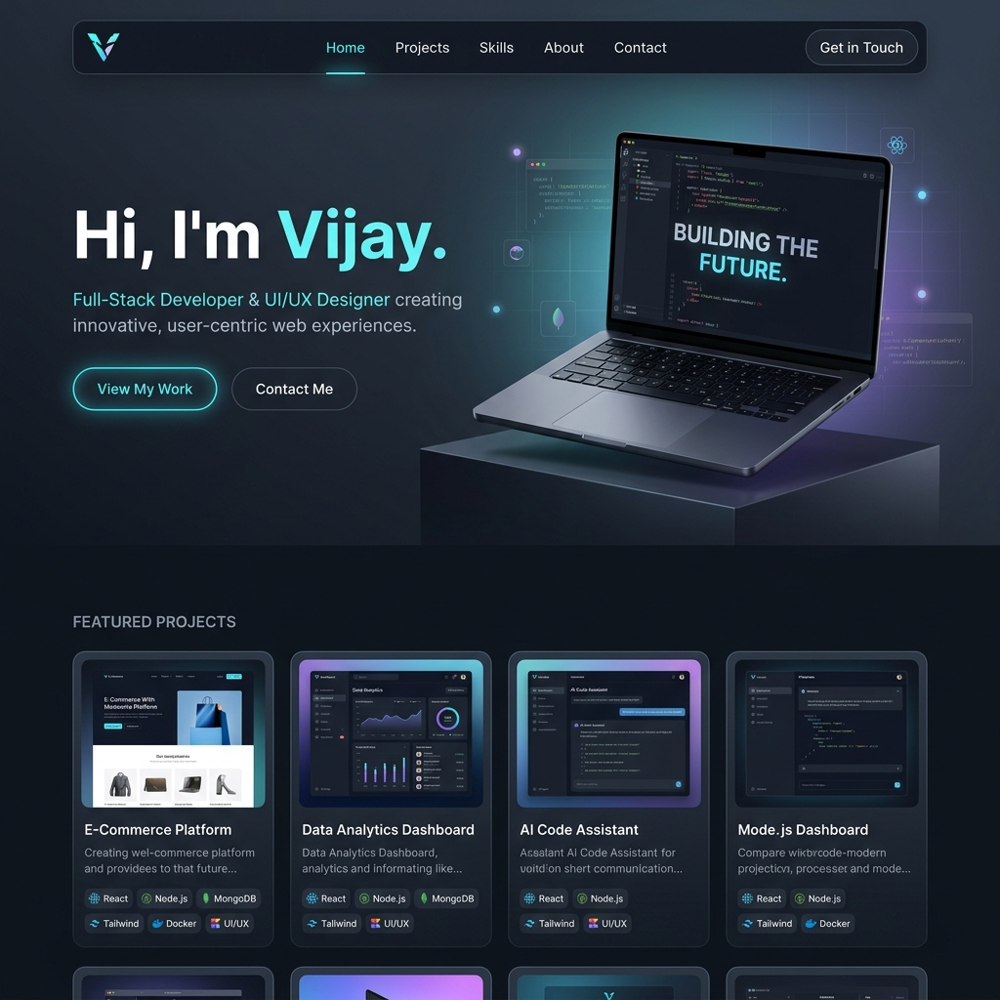

# Minimal Portfolio

🚀 **Live Demo:** [vijay.antideploy.com](https://vijay.antideploy.com/)

An ultra-modern, high-performance developer portfolio built with **Next.js 16**, **React 19**, **Three.js / React Three Fiber**, and **Tailwind CSS v4**.



---

## ✨ Features

- 🎨 **3D Interactive Hero**: Realistic 3D MacBook Pro hero model rendered with `@react-three/fiber` and `@react-three/drei`.
- ⚡ **Lightning Fast**: Built on Next.js 16 App Router with Turbopack for optimal performance.
- 📱 **Fully Responsive & Accessible**: Optimized for all viewports from mobile to 4K displays.
- 🛠️ **Project Showcase & Interactive Skills**: Highlight key projects with responsive media cards and skill breakdown.
- 📬 **Contact & Social Links**: Seamless user contact section with social links.
- 🌐 **SEO & OpenGraph Ready**: Configured dynamic sitemap (`sitemap.ts`) and metadata optimization.

---

## 🛠️ Tech Stack

- **Framework**: [Next.js 16](https://nextjs.org/) (App Router)
- **UI Library**: [React 19](https://react.dev/)
- **3D Graphics**: [Three.js](https://threejs.org/) & [React Three Fiber](https://r3f.docs.pmnd.rs/)
- **Styling**: [Tailwind CSS v4](https://tailwindcss.com/)
- **Animations**: [Framer Motion](https://www.framer.com/motion/)
- **Deployment**: [Antideploy](https://antideploy.com/)

---

## 🚀 Getting Started

First, clone the repository and install dependencies:

```bash
git clone https://github.com/vijaydotin/minimal-portfolio.git
cd minimal-portfolio
npm install
```

Run the development server:

```bash
npm run dev
```

Open [http://localhost:3000](http://localhost:3000) with your browser to see the result.
